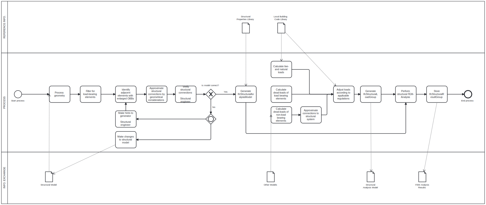
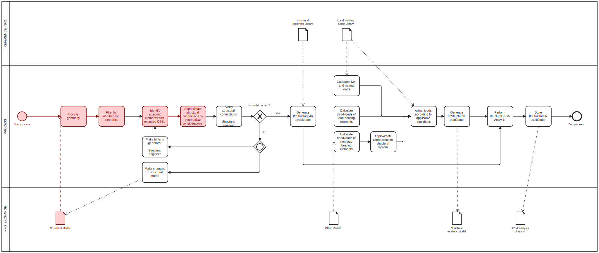

# Assignment 2 - OpenBIM Analysis

__41934 - Advanced BIM, E23__ - _Technical University of Denmark_

**Group 48:**
- Kaare G. S. Hansen, s214282 - DTU

## Use-cases

Generation of an analytical structural model according to provided structural IFC-model of load bearing members.
In addition, load cases may be generated based on additionally provided IFC-models (Arch, MEP etc...), taking into consideration dead-loads of non-structural elements, zones/spaces, local building codes etc...

The use case/tool is intended for either:

### Rapid structural design and dimensioning

- The abilility for non-structural engineers to quickly analyse and iterate their model-design without the need of a structural engineer.
- Structural analysis results are only indicative, and cannot be used for final verification.
- Quickly estimate dimensioning of members, and if structural design is likely a viable solution.

### Speed-up for structural engineers

- Rapid generation of a likely valid/correct structural analysis model.
- Verification and correction workflow. Rather than having the structural engineer model manually by hand, the structural engineer verifies the generated structural analysis model and make corrections if/whenever necessary.

## Disciplinary knowledge

## Utilized IFC-concepts

**What disciplinary analysis does it require?**

**What building elements are you interested in?**

**What (use cases) need to be done before you can start your use case?**

**What is the input data for your use case?**

**What other use cases are waiting for your use case to complete?**

## Future extensions
A list of possible future extensions of functionality:

- Identification of inappropriately dimensioned structural members
    - Are deformation requirements met or greatly exceeded?
    - Same for stresses etc...
    - List/charts of under-engineered, appropriate and over-engineered members
- Provide suggestions for rightsized members
    - Adjustment of beam/column profiles and materials
    - Calculate rebar layout/sizes

## IDM diagrams

### Abstract specified IDM

The IDM diagram for the final intended (but unimplemented) tool:

### Implemented IDM

The IDM diagram that describes the tool implemented in this assignment.

Colored in red is implemented parts:

## Using the tool

### Prerequisites for script-execution

In addition to common Python-modules, Open Cascade is required.

Refer to below files for specified environment:

- [`environment.yml`](environment.yml)
- [`requirements.txt`](requirements.txt)
