# Assignment 3 - OpenBIM Change

__41934 - Advanced BIM, E23__ - _Technical University of Denmark_

**Group 48:**
- Kaare G. S. Hansen, s214282 - DTU

**NB.** _Changes_ has been made to this reporsitory post assignment due date. Refer to `commit-xxxxxx` for last commit before due date.

## Use-cases

Generation of an analytical structural model according to provided structural IFC-model of load bearing members.
In addition, load cases may be generated based on additionally provided IFC-models (Arch, MEP etc...), taking into consideration dead-loads of non-structural elements, zones/spaces, local building codes etc...

The use case/tool is intended for either:

### Rapid structural design and dimensioning

- The abilility for non-structural engineers to quickly analyse and iterate their model-design without the need of a structural engineer.
- Structural analysis results are only indicative, and cannot be used for final verification.
- Quickly estimate dimensioning of members, and if structural design is likely a viable solution.

### Speed-up for structural engineers

- Rapid generation of a likely valid/correct structural analysis model.
- Verification and correction workflow. Rather than having the structural engineer model manually by hand, the structural engineer verifies the generated structural analysis model and make corrections if/whenever necessary.

## Disciplinary knowledge

For the final tool, comprehensive knowledge about structural engineering is required.
For further development, knowledge about correct modelling of analytical FEM-models is also required.

For this implementation basic knowledge of structural engineering has been used.

## Utilized IFC-concepts

- Geometric processing
- Psets to identify load-bearing elements
- Filtering based on classes
- IfcRepresentation

## Disciplinary analysis

- Structural FEM-Analysis
- Cross-section analysis

## Elements of interest

For the implented tool, every element derived of `IfcBuildngElement` marked as load-bearing is of interest.

For the further developed tool, all entities derived of `IfcElement` with a physical geometry is of interest to calculate accurate deadl-load. `IfcSpatialElement` is also of interest to determine live-loads.

## Future extensions
A list of possible future extensions of functionality:

- Identification of inappropriately dimensioned structural members
    - Are deformation requirements met or greatly exceeded?
    - Same for stresses etc...
    - List/charts of under-engineered, appropriate and over-engineered members
- Provide suggestions for rightsized members
    - Adjustment of beam/column profiles and materials
    - Calculate rebar layout/sizes

## Future development ideas

If I had the time and resources to develop the tool further:

- Analyse steel-connections and create new geometry for the optimal connection
- Resize profile dimensions according to requirements
- Parametric library of structural connections
- Generate report of requirements... E.g. highlight members that exceed deflection requiremnets...

## Reflection
- ifcopenshell provided axis are not reliable. May be entirely out of actual elements OBB.
- I had very great ambitions in A2, but it proved difficult to implement at universal algorithm for deciding where to place nodes, and most difficult, when to merge nodes. However, in the meantime up to this assignment, I learned that I didn't need to merge nodes as much as I thought. Instead, it is a viable option to connect close nodes with very stiff "virtual" structural members. This made the creation of the model much easier.

## IDM diagrams

### Abstract specified IDM

The abstract IDM diagram for the overall BEP. This diagram covers the whole process of the structural analysis. The actual process of the creation of the analytical model, is described in the "focused-IDM" found below. 

<!--
https://demo.bpmn.io/new
-->

### Focused/implemented IDM

This IDM diagram describes the very tool that analyses IFC-models and creates structural analytical models.

Colored in red, are actually implemented parts:

## Using the tool

### Prerequisites for script-execution

In addition to common Python-modules, Open Cascade is required.

Refer to below files for specified environment:

- [`environment.yml`](environment.yml)
