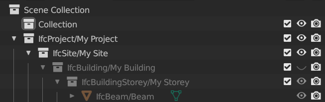
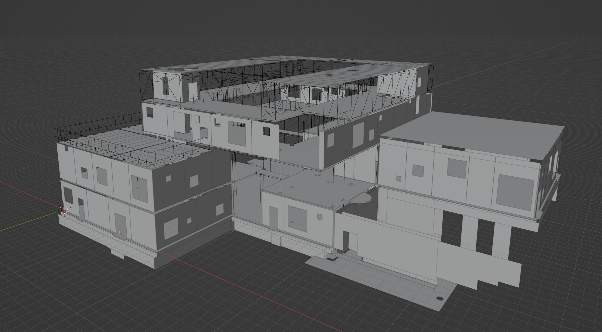

=======================
A4 - OpenBIM Champion
=======================

As a part of this assingment, is the documentation of PyConBIM.

Use-case is described in :doc:`A3`.

This assignment targets targets *OpenBIM Guru, level-3*.
That is, further development of this tool by structural engineers with software development skills.

Prerequisites
----------------------

Though this is assingment 4, the working directory is the same as in assingment 3, :code:`./Assignments/A3/`.

#. First, please refer to :doc:`installation`.

#. Secondly, place :code:`LLYN - STRU.ifc` in the :code:`models` directory.

Running the CLI tool
-----------------------------

Make sure you are in the working directory, :code:`./Assignments/A3/`.

Execute the following command:

:code:`python main.py`

The help menu should appear. Currently, the only command is :code:`run`.

:code:`run` takes one argument, the model-configuration. The model-configurations are specified in :code:`input/config.json`.

First model
~~~~~~~~~~~~~~~~~~~~

Let's run with a small dummy-model first:

:code:`python main.py run "Simple frame"`.

Please note the quotation marks, as the name has a space. Names are case-sensitive.

A graphical user interface should appear, with the generated analytical model. This is only for viewing purposes.

After execution is done, the :code:`output` directory should now contain a :code:`.ifc` file with
the `IfcStructuralAnalysisModel <https://ifc43-docs.standards.buildingsmart.org/IFC/RELEASE/IFC4x3/HTML/lexical/IfcStructuralAnalysisModel.htm>`_.

In BlenderBIM, or any other IFC viewer, open the generated file to view the structural analysis model.

Hide the entire :code:`IfcBuilding` to easily view the analytical model.

The :code:`IfcStructuralItem` s should now be visible:

.. figure:: media/Simple-frame-StructuralModel.png
   :alt: analytical-simple-frame.ifc

   BlenderBIM (analytical-simple-frame.ifc).

Large Ifc-model
~~~~~~~~~~~~~~~~~~~~~~~~~~~~~~~~

Now let's generate the analytical model for the large model, :code:`LLYN - STRU.ifc`.

Once again, open the generated file in BlenderBIM, to view the structural analysis model.

:code:`python main.py run "LLYN - STRU"`.

   BlenderBIM (analytical-LLYN.ifc).

Tutorial notebook
--------------------

:doc:`notebooks/A4-Tutorial`

.. toctree::
   :maxdepth: 2
   :caption: Contents:

   notebooks/A4-Tutorial
